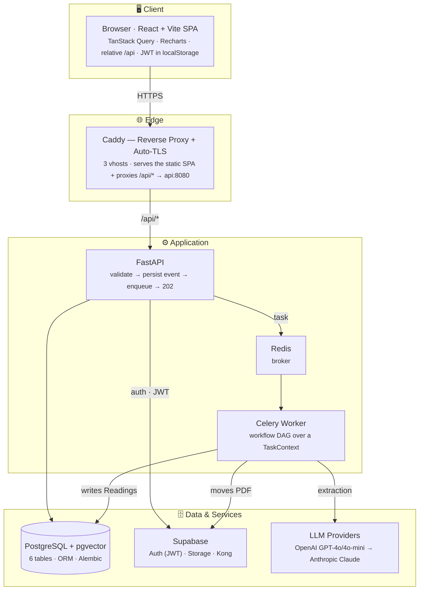
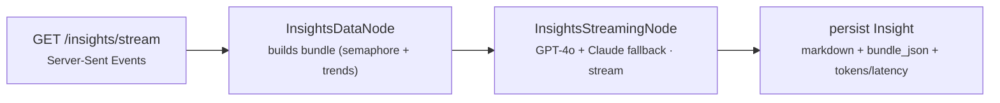

# Architecture — Biopanel

A web app where a patient uploads their lab-report PDFs and gets every biomarker extracted,
normalized and queryable as time series — regardless of the lab's format or language.

> Visual diagrams (portfolio): [`architecture.svg`](architecture.svg) · [`flow.svg`](flow.svg) ·
> data model in [`DATA_MODEL.md`](DATA_MODEL.md) / [`data-model.svg`](data-model.svg).

**Stack**

| Layer | Technology |
|---|---|
| Frontend | React 18 · Vite · TypeScript · TailwindCSS · Recharts · TanStack Query |
| Edge | Caddy (auto-TLS / Let's Encrypt) — reverse proxy + static server |
| API | FastAPI (Python 3.13) |
| Async | Celery worker + Redis (broker) |
| AI | PydanticAI · OpenAI GPT-4o / GPT-4o-mini · Anthropic Claude (FallbackModel) |
| Data | PostgreSQL + pgvector · SQLAlchemy ORM · Alembic |
| Platform | Supabase (Auth/GoTrue · Storage · Kong) · Docker Compose · Hetzner VM |

---

## 1. System architecture

Core **"accept-and-delegate"** pattern: the API accepts the event synchronously, persists it and
enqueues it; the heavy work (extraction, LLM) runs asynchronously in the worker. The API returns
`202` immediately and stays available under load.

**Key decisions**

- **Same-origin frontend** — the client uses a relative `/api` (zero `VITE_*`). In production a
  single Caddy vhost serves the SPA *and* proxies `/api/*` to the backend → **no CORS, no
  build-time API URL, zero code changes** between dev and prod. In dev, the Vite proxy replicates
  that exact rewrite.
- **Sync accept, async process** — the API never runs the workflow in the request path.
- **DAG of nodes** — each workflow is a directed acyclic graph of nodes that pass a shared
  `TaskContext` (GenAI Launchpad framework).
- **pgvector already in the stack** — ready for a future biomarker RAG without switching engines.

---

## 2. Processing flow (PDF → queryable)

What happens "behind the scenes" when the patient uploads a PDF, in three phases.

```mermaid
flowchart LR
    U["POST /upload<br/><small>drag in PDFs</small>"]
    V["Validation<br/><small>PDF · ≤20MB · SHA-256 dedup</small>"]
    L["LabReport (PROCESSING)<br/><small>+ PDF to provisional path</small>"]
    Q["Enqueue Celery<br/><small>202 {lab_report_id, task_id}</small>"]

    subgraph DAG["Celery worker · LabReportProcessingWorkflow"]
        direction LR
        N1["①  PDFTextExtractionNode<br/><small>pdfplumber → plain text</small>"]
        N2["②  StructuredParsingNode<br/><small>LLM → rows + date/lab/type<br/>+ canonical names</small>"]
        N3["③  PreviewBuilderNode<br/><small>upsert Biomarkers · move PDF<br/>· write Readings (PENDING)</small>"]
        N1 --> N2 --> N3
    end

    P["status PENDING"]
    PO["Frontend polling<br/><small>every 2 s</small>"]
    PR["GET /preview<br/><small>patient reviews</small>"]
    CF["POST /confirm<br/><small>→ CONFIRMED</small>"]
    QR["Readings queryable<br/><small>series · dashboard · CSV</small>"]

    U --> V --> L --> Q --> N1
    N3 --> P --> PO --> PR --> CF --> QR
```

**The heart of the design**: all the "intelligence" (dates, lab name, study type, normalizing
names to a canonical one) lives in the **LLM**. `pdfplumber` is deliberately dumb — text extraction
only. **Zero regex or per-lab rules**, which is why it handles any format/language without new
code. Cost ≈ **$0.0005/page** (GPT-4o-mini over text, not vision); ≈ **30–45 s per study**.

### AI layer — on-demand analysis (over confirmed Readings)

PydanticAI's `FallbackModel` switches to Claude automatically if the GPT-4o request fails, without
interrupting the SSE stream. `model_used` is persisted for traceability (not shown to the user).

---

## 3. Deployment

A single **Hetzner VM** running the Docker Compose stack behind Caddy. Compose **base + override**
pattern: `docker-compose.yml` (launchpad + supabase) is the base; Caddy and the dockerized
frontend are **prod-only** overlays. Migrations run automatically on API boot
(`alembic upgrade head`). The full data model and its engineering decisions live in
[`DATA_MODEL.md`](DATA_MODEL.md).
