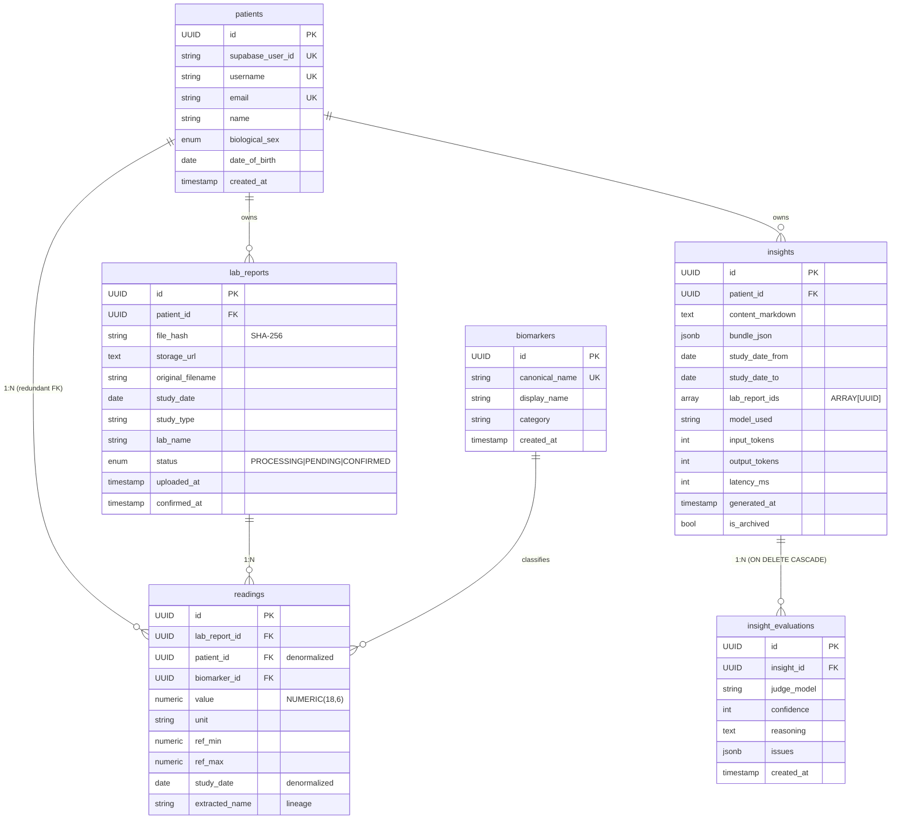

# Data Model — Biopanel

How and why the data layer is modeled. Visual diagram: [`data-model.svg`](data-model.svg).
System context: [`ARCHITECTURE.md`](ARCHITECTURE.md).

**Engine**: PostgreSQL · **ORM**: SQLAlchemy (declarative models as the single source of truth) ·
**Migrations**: Alembic (versioned, autogenerated) · **Native PG types**: `UUID`, `NUMERIC`,
`JSONB`, `ARRAY`, `ENUM`, `DATE`.

The design is a **lightweight dimensional schema**: `readings` is the fact table, and `patients`,
`lab_reports` and `biomarkers` are its dimensions. The overall strategy is to **normalize where the
data warrants it and deliberately denormalize the hot read paths** — normalized, but not
over-normalized, so query speed never pays for purity.

---

## ERD

---

## Data engineering decisions

| # | Decision | Rationale |
|---|----------|-----------|
| 1 | **`readings` is a fact table** | Lightweight dimensional schema: each row is **one fact** (a measurement) tied to three dimensions — `patient` (who), `lab_report` (when / which document) and `biomarker` (what was measured). The time series the patient sees = filter `readings` by `biomarker_id` and `ORDER BY study_date`. |
| 2 | **`readings.patient_id` is redundant — on purpose** | It is derivable via `lab_report_id → lab_reports.patient_id`, but it's **duplicated** to eliminate a JOIN on the system's hottest query (fetching *all* of a patient's readings for the dashboard and time series). Explicit trade-off: **+16 bytes/row** (one UUID) in exchange for dropping a JOIN on every read. **This is the canonical example of "normalized, but not over-normalized".** |
| 3 | **`readings.study_date` denormalized** from `lab_reports` | Lets us sort and filter the time series directly on `readings`, with no JOIN back to the `lab_report`. Same logic as #2 applied to the most common read path. |
| 4 | **`biomarkers` is a shared canonical dimension** (it has no `patient_id`) | "Hemoglobin" exists **once** system-wide. The LLM normalizes lab aliases (HGB / Hb / Hemoglobina) to a single `canonical_name` with a `UNIQUE` constraint. This separates the **concept** (correct 3NF) from the **measured value**, and enables future cross-patient aggregations (population benchmarks) without reprocessing anything. |
| 5 | **`ref_min` / `ref_max` / `unit` live in `readings`, NOT in `biomarkers`** | Deliberate contrast with #4. The reference range **varies by lab, age and sex** — even between two studies of the same patient. It's an attribute of the **fact** (the measurement in context), not of the canonical concept. Normalizing it onto the biomarker would **lose information**. Here over-normalizing would be a *bug*, not a virtue. |
| 6 | **`readings.extracted_name` is kept** | Alongside the canonical `biomarker_id`, the name **exactly as it appeared in the PDF** is stored. This is **data lineage / auditability**: you can see how the lab labeled it vs. the normalization the system applied, and debug normalization quality. |
| 7 | **Relational + document hybrid: `JSONB` + `ARRAY[UUID]`** | `insights.bundle_json` (an immutable snapshot of the data fed to the LLM) and `insight_evaluations.issues` are stored as **`JSONB`** — schema-flexible; there's no point normalizing something always read as a block. `insights.lab_report_ids` uses **`ARRAY[UUID]`** instead of an M:N bridge table: the relationship is **read-only**, immutable once generated, and never queried in reverse ("which insights use this lab_report?"). The array avoids a JOIN for a relationship that doesn't need one. |
| 8 | **`UUID` primary keys everywhere** (not `int` autoincrement) | They're generated **client-side** by the ORM (`default=uuid.uuid4`): the `id` is needed to build the PDF's Storage path **before** the row exists in the DB. They also don't expose counts or insertion order (**privacy** for medical data) and are sharding/distributed-friendly down the line. |
| 9 | **`NUMERIC(18,6)` for values and ranges** (not `float`) | Lab values are exact decimals; `float` introduces binary rounding error that is **unacceptable** in a medical context. `NUMERIC` = exact fixed-precision decimal. |
| 10 | **Declarative ORM + Alembic** | The SQLAlchemy models are the **single source of truth** for the schema; Alembic versions and autogenerates the migrations (7 to date). The delete graph is modeled with `cascade="all, delete-orphan"` (`patient → lab_reports → readings`; `patient → insights → evaluations`); `insight_evaluations` additionally has `ON DELETE CASCADE` at the **DB level** — defense in depth, not ORM-only. |
| 11 | **Boundary with Supabase Auth (dual identity)** | Credentials live in `auth.users` (GoTrue/Supabase); the app profile lives in `patients`, linked by `supabase_user_id`. `patients.email` **duplicates** the one in `auth.users` **on purpose**, to resolve login (username → email → GoTrue) without a cross-service call. The app **never** does a cross-schema JOIN to `auth.users`. |
| 12 | **Native PostgreSQL `ENUM`s** | `lab_report.status` (`PROCESSING`/`PENDING`/`CONFIRMED`) and `biological_sex` are native enums → DB-level type safety, not free-form strings. *(Known gotcha: the native enum stores the member name in UPPERCASE, not its `.value`.)* |

---

## Integrity rules

- **Uniqueness**: `biomarkers.canonical_name`, `patients.username`, `patients.email` and
  `patients.supabase_user_id` are `UNIQUE`. PDF deduplication is by `file_hash` (SHA-256) at the
  application level (409 on re-upload of the same PDF by the same patient).
- **Delete cascades**: deleting a `Patient` clears its entire graph (`lab_reports`, `readings`,
  `insights`, and transitively `insight_evaluations`). Deleting a `LabReport` also removes the PDF
  from Storage.
- **States**: a `LabReport` transitions `PROCESSING → PENDING → CONFIRMED`. Only readings from
  `CONFIRMED` reports are visible in the dashboard and the export.

## Why ORM and not raw SQL

This is an **OLTP** workload (transactional per-patient reads/writes), not high-volume analytics.
The ORM gives: (1) the models as the single schema contract, (2) autogenerated, versioned
migrations, (3) the relationship/cascade graph declared in one place, and (4) safe, composable
queries from node and endpoint code. Where a query doesn't fit the generic repository, it drops to
`session.query(...).filter_by(...)` — without leaving the ORM session.
