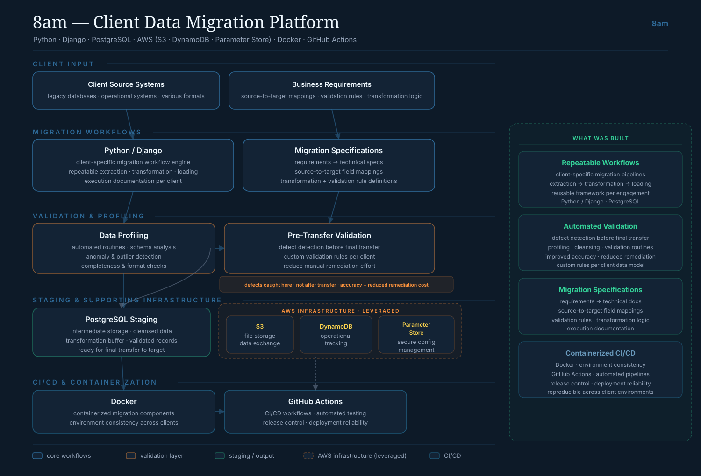
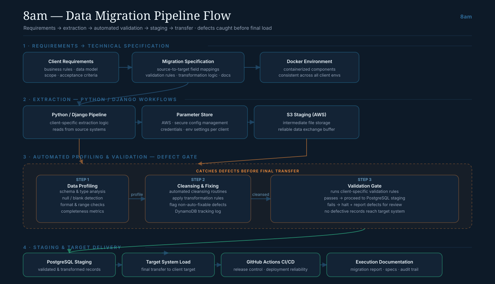

[:material-arrow-left: Case Studies](../index.md){ .back-link }

# 8am — Client Data Migration Engineering

!!! abstract "Case Study Summary"
    **Company**: 8am — data migration consultancy  
    **Role**: Data Migration Engineer  
    **Period**: Sep 2024 – Sep 2025  
    **Stack**: Python · Django · PostgreSQL · AWS (S3 · DynamoDB · Parameter Store) · Docker · GitHub Actions  

    **What it does**: Repeatable migration workflows that move business-critical datasets from client source systems to their target systems — with automated profiling and validation that catches defects *before* the final transfer. Clients are not named for confidentiality.

## Context

Data migrations fail in predictable ways: bad records slip through, a transformation rule is misread, and the problem only shows up after the data has already landed in the target system. My work at 8am was to build migration workflows that were **repeatable per client** and that surfaced defects early, so the final load was something the team could trust.

Each engagement started from the client's business requirements and ended with a documented, validated transfer.

## What I built

I built client-specific migration workflows in **Python/Django** that handle extraction, transformation, validation and loading as a repeatable pipeline, backed by AWS for storage, configuration and tracking.

<figure class="diagram" markdown="span">
  
  <figcaption><strong>Platform architecture.</strong> Client requirements become migration specs, a Python/Django workflow engine handles extraction and transformation, automated profiling and pre-transfer validation gate the data, and a PostgreSQL staging layer holds validated records — with AWS (S3, DynamoDB, Parameter Store), Docker and GitHub Actions underneath. Click to enlarge.</figcaption>
</figure>

The main pieces:

- **Requirements → specification** — turned client business rules into technical migration specs: source-to-target field mappings, validation rules, transformation logic, and execution documentation.
- **Repeatable workflows** — a Python/Django engine for extraction, transformation, validation and loading that could be reused per engagement instead of rebuilt each time.
- **AWS infrastructure** — S3 for staging and data exchange, DynamoDB for operational tracking, and Parameter Store for secure, per-client configuration.
- **Containerization & CI/CD** — Docker for environment consistency across clients, GitHub Actions for automated testing and controlled releases.

## The validation gate

The part I care most about: nothing reaches the target system before it passes an automated **profiling and validation gate**. Profiling analyzes schema, types, nulls, formats and completeness; cleansing applies transformation rules and flags anything that can't be auto-fixed; a validation step runs client-specific rules and **halts on failure** rather than letting defective records through.

<figure class="diagram" markdown="span">
  
  <figcaption><strong>Migration flow.</strong> Requirements → extraction (Python/Django, config from Parameter Store, staging in S3) → a defect gate (profiling → cleansing → validation that halts and reports on failure) → PostgreSQL staging → final transfer to the target, with execution documentation as an audit trail. Click to enlarge.</figcaption>
</figure>

The effect is that defects are caught **before** the final transfer, not after — which reduced manual remediation and made each migration auditable through its execution documentation.

## Tech Stack

- **Languages / frameworks**: Python, Django
- **Storage**: PostgreSQL (staging), AWS S3
- **AWS**: S3, DynamoDB (tracking), Parameter Store (secure config)
- **Containerization / CI-CD**: Docker, GitHub Actions

## What this demonstrates

This is the side of data engineering that's less about scale and more about **correctness and repeatability**: translating business requirements into precise specs, validating aggressively before committing, and leaving documentation the client can maintain. The same validation-first mindset carries directly into pipeline work.

-   :material-calendar-check:{ .lg .middle } Planning a data migration?

    ---

    Migrations go wrong in the validation, not the copy. I build the gates that catch defects before they reach your target system. Let's talk.

    [Book Intro Call :material-arrow-top-right:](https://calendly.com/andres-andresavila/introduction-call){ .md-button .md-button--primary }

