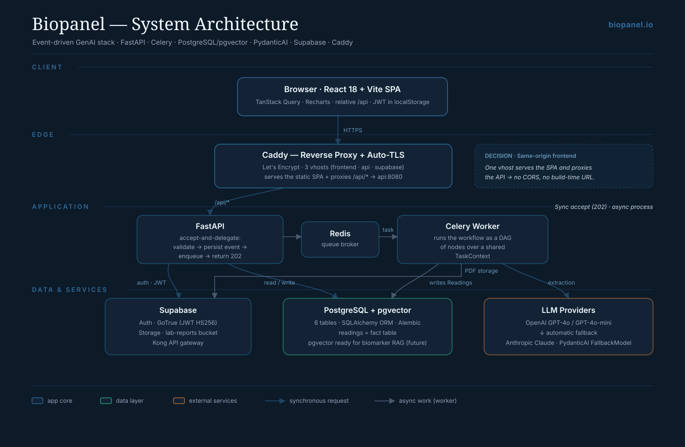
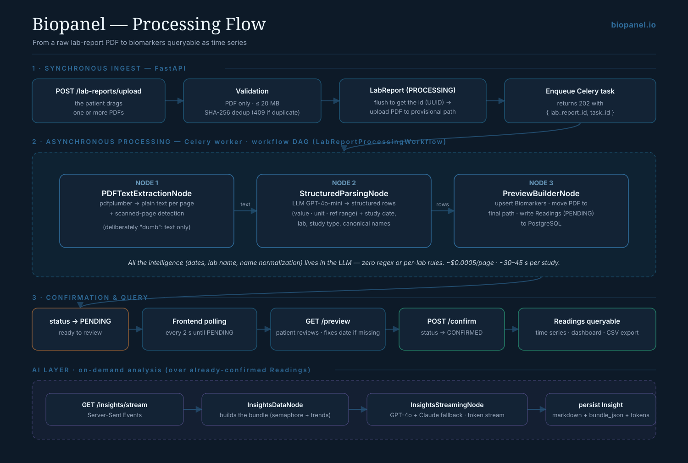
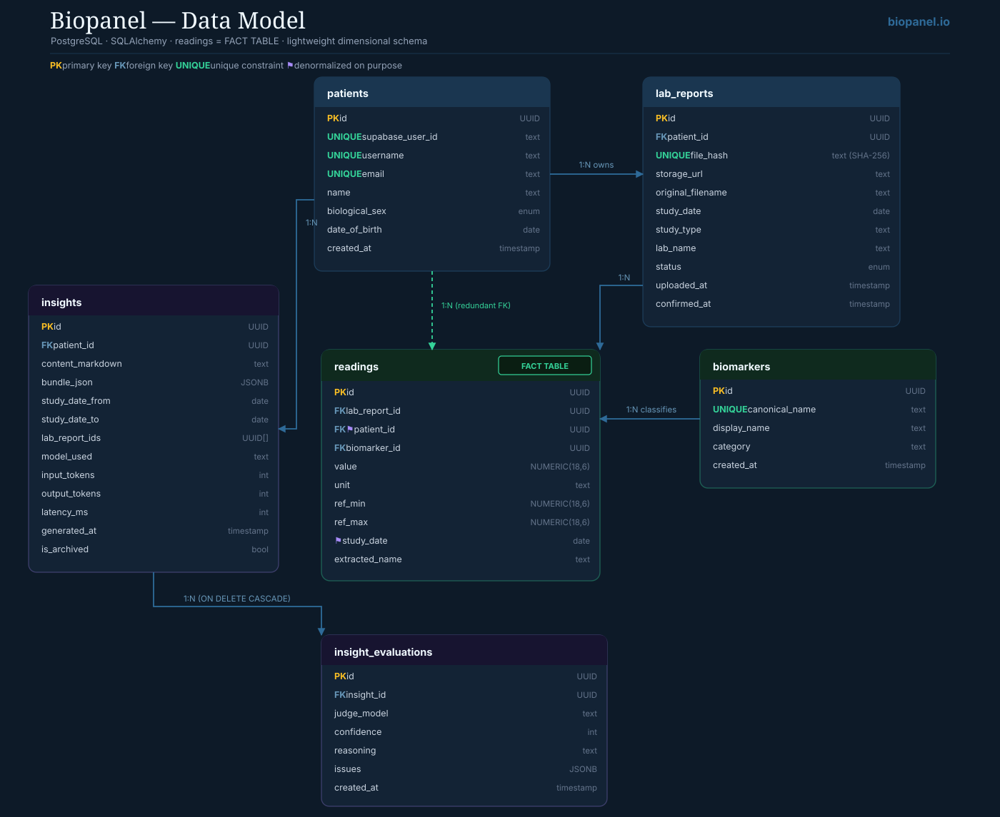

[:material-arrow-left: Case Studies](../index.md){ .back-link }

# biopanel.io — AI-Powered Health Analytics Platform

!!! abstract "Project Summary"
    **Project**: [biopanel.io](https://biopanel.io)  
    **Type**: Personal product — built and run end-to-end  
    **Stack**: Python · FastAPI · Celery · Redis · PostgreSQL · Supabase · React 18 · TypeScript · Docker · LLMs  

    **What it does**: Extracts structured biomarker data from blood-test PDFs across different laboratories, languages, and layouts — without lab-specific parsing rules. A user uploads a lab report, the system normalizes the values, flags out-of-range markers, and renders an interactive health dashboard.

## Demo

A 3-minute walkthrough: uploading a lab report, the asynchronous extraction, reviewing and confirming the values, and the resulting health dashboard.

  <iframe src="https://www.youtube-nocookie.com/embed/THE5kNJC-RQ" title="biopanel.io — Product Demo" loading="lazy" allow="accelerometer; autoplay; clipboard-write; encrypted-media; gyroscope; picture-in-picture; web-share" referrerpolicy="strict-origin-when-cross-origin" allowfullscreen></iframe>

## The Problem

Blood test results come in many different PDF formats — different labs, languages, layouts, and reference ranges. The usual extraction approach needs lab-specific parsing rules that break as soon as a format changes.

The goal: extract biomarkers reliably from a PDF without knowing its layout in advance, and keep the system stable under real usage.

## Architecture & Approach

I designed an **asynchronous extraction pipeline** that treats each PDF as a structured-extraction problem for a language model rather than a pattern-matching problem. The core pattern is **accept-and-delegate**: the API validates and enqueues the request and returns `202` immediately, while the heavy work (PDF parsing + LLM extraction) runs in a Celery worker.

<figure class="diagram" markdown="span">
  
  <figcaption><strong>System architecture.</strong> React SPA → Caddy (TLS + reverse proxy) → FastAPI, which persists, enqueues to Redis and returns 202. A Celery worker handles extraction and the LLM calls; PostgreSQL + pgvector and Supabase (auth/storage) sit behind it. Click to enlarge.</figcaption>
</figure>

Key decisions:

- **Sync accept, async process** — the API never runs the workflow in the request path, so it stays responsive under load.
- **Workflow as a DAG of nodes** — each stage (text extraction → structured parsing → preview build) is an explicit node passing a shared `TaskContext`, so failures surface instead of hiding.
- **Multi-provider LLM fallback** — GPT-4o/GPT-4o-mini primary, Claude as automatic fallback (via PydanticAI's `FallbackModel`), so a provider outage doesn't break a run.
- **No hardcoded parsing rules** — `pdfplumber` only pulls plain text; the LLM handles dates, lab name, study type, and name normalization. That's why new formats and languages work without new code.
- **pgvector already in the stack** — PostgreSQL ships with pgvector so a future biomarker RAG can be added without changing engines.

## Processing flow

The path from a raw PDF to queryable time series runs in three phases: a **synchronous ingest** (validate, dedup by SHA-256, persist, enqueue), **asynchronous processing** in the Celery worker, and a **confirmation step** where the user reviews the extracted values before they're committed.

<figure class="diagram" markdown="span">
  
  <figcaption><strong>Processing flow.</strong> Upload → validation → Celery DAG (pdfplumber → LLM structured parsing → preview) → the frontend polls until the report is ready to review → confirm. A separate on-demand AI layer streams insights over already-confirmed readings via Server-Sent Events. Click to enlarge.</figcaption>
</figure>

A couple of details worth calling out:

- The extraction status is surfaced to the frontend by **polling every ~2s** until the report is ready; the user then reviews and confirms before any reading is marked `CONFIRMED`.
- The **AI insights** feature is the part that uses **Server-Sent Events** — it streams a generated analysis over confirmed readings, with the GPT-4o → Claude fallback applied mid-stream if needed.
- Cost is roughly **$0.0005/page** (GPT-4o-mini over text, not vision) and about **30–45 seconds per study**.

## Data model

The data layer is a **lightweight dimensional schema**: `readings` is the fact table, and `patients`, `lab_reports` and `biomarkers` are its dimensions. The guiding rule was to **normalize where it matters and deliberately denormalize the hot read paths** — normalized, but not over-normalized.

<figure class="diagram" markdown="span">
  
  <figcaption><strong>Data model (ERD).</strong> PostgreSQL + SQLAlchemy. <code>readings</code> is the fact table linked to <code>patients</code>, <code>lab_reports</code> and a shared canonical <code>biomarkers</code> dimension. Click to enlarge.</figcaption>
</figure>

### Data engineering decisions

A few of the choices behind the schema, and the reasoning:

| Decision | Why |
|---|---|
| **`readings` is a fact table** | Each row is one measurement tied to three dimensions: *who* (`patient`), *when/which document* (`lab_report`) and *what* (`biomarker`). The time series the user sees is just `readings` filtered by `biomarker_id`, ordered by `study_date`. |
| **`readings.patient_id` is redundant — on purpose** | It's derivable through `lab_report_id`, but duplicating it removes a JOIN on the hottest query (loading all of a patient's readings). The trade-off is explicit: +16 bytes/row to drop a JOIN on every read. |
| **`biomarkers` is a shared canonical dimension** | "Hemoglobin" exists once system-wide. The LLM maps lab aliases (HGB / Hb / Hemoglobina) to one `canonical_name` with a `UNIQUE` constraint — separating the concept from the measured value. |
| **Reference range and unit live in `readings`, not `biomarkers`** | The range varies by lab, age and sex — even between two studies of the same patient. It's an attribute of the measurement in context, not of the canonical concept. Normalizing it onto the biomarker would lose information. |
| **`readings.extracted_name` is kept** | The name exactly as it appeared in the PDF is stored alongside the canonical `biomarker_id` — data lineage, so normalization quality can be audited and debugged. |
| **`JSONB` + `ARRAY[UUID]` where the relationship is read-only** | LLM input snapshots are stored as `JSONB`, and `insights.lab_report_ids` uses `ARRAY[UUID]` instead of an M:N bridge table — the link is immutable and never queried in reverse, so the array avoids a JOIN that isn't needed. |
| **`NUMERIC(18,6)` for values, not `float`** | Lab values are exact decimals; `float` introduces binary rounding error that isn't acceptable in a medical context. |

The schema is defined as declarative SQLAlchemy models (the single source of truth) with Alembic-versioned migrations; delete cascades are modeled in the ORM and backed by `ON DELETE CASCADE` at the database level.

## Tech Stack

**Backend**

- FastAPI — async REST API with OpenAPI docs
- Celery + Redis — async task queue running the workflow DAG
- PostgreSQL + pgvector — persistence (pgvector in place for future semantic search)
- Supabase — auth and storage
- Alembic — database migrations
- Docker Compose — local development and deployment

**Frontend**

- React 18 + TypeScript — type safety end-to-end
- Recharts + custom components for biomarker visualization
- Responsive, mobile-first layout
- Polling for extraction status; SSE for the AI insights stream

**AI / LLM**

- OpenAI GPT-4o / GPT-4o-mini — primary extraction and insights
- Anthropic Claude — automatic fallback
- PydanticAI — typed LLM calls and `FallbackModel` orchestration
- Prompt design for structured biomarker extraction

## Results

- Extracts biomarkers from PDFs across different labs, languages, and layouts with no layout-specific configuration
- A typical study processes in about **30–45 seconds**
- Multi-provider fallback keeps extraction working when a single provider has an outage
- Built and run end-to-end as a personal product — [biopanel.io](https://biopanel.io)

## What this demonstrates

I built and run this end-to-end — architecture, backend, frontend, and deployment. It's the clearest example of how I work across the full stack of an AI product.

For data engineering work, the patterns here are the same ones I bring to client pipelines: async DAGs, typed stages, explicit failure handling, and provider fallback.

-   :material-calendar-check:{ .lg .middle } Interested in AI-powered data systems?

    ---

    Let's talk about what this kind of architecture could look like for your use case.

    [Book Intro Call :material-arrow-top-right:](https://calendly.com/andres-andresavila/introduction-call){ .md-button .md-button--primary }

