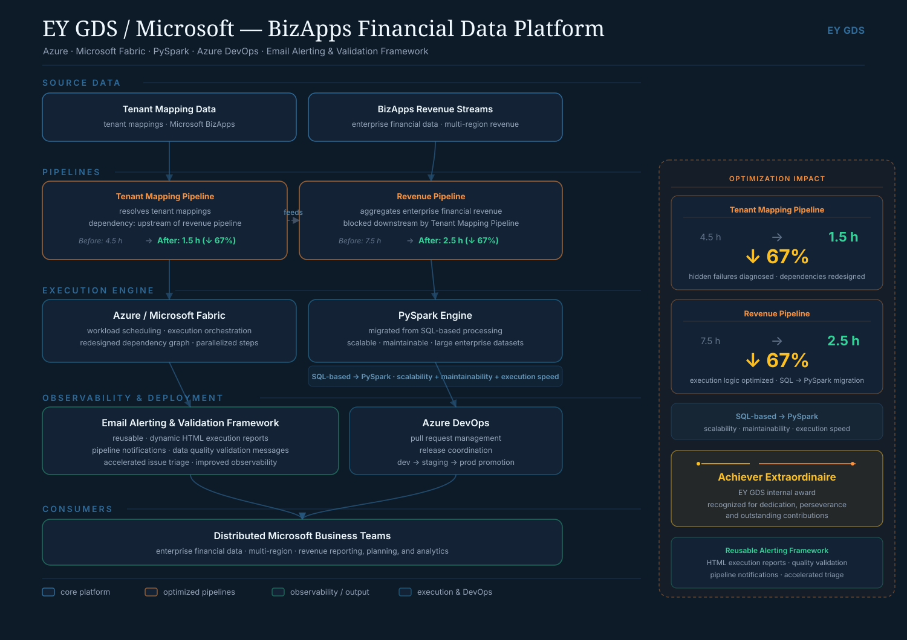
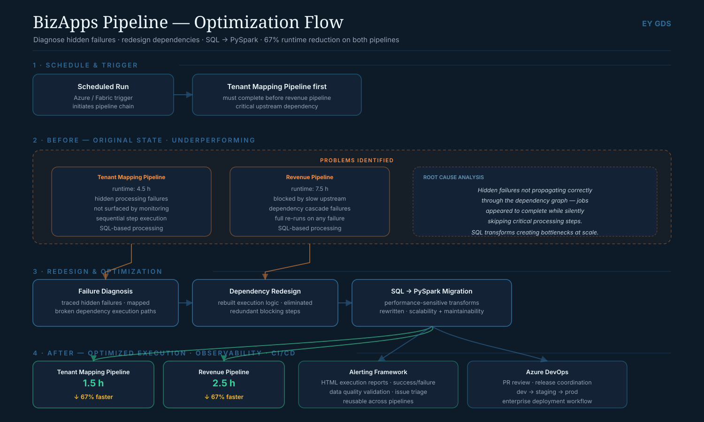

[:material-arrow-left: Case Studies](../index.md){ .back-link }

# EY / Microsoft — Financial Pipeline Optimization

!!! abstract "Case Study Summary"
    **Client**: Microsoft (via EY GDS) — BizApps Financial Data Platform  
    **Role**: Senior Data Engineer  
    **Period**: Sep 2025 – Present  
    **Stack**: Azure Fabric · PySpark · Azure DevOps · Python  

    **Impact**:

    - **67% runtime reduction** across two critical financial pipelines
    - Tenant Mapping Pipeline: **4.5h → 1.5h** (−67%)
    - Revenue Pipeline: **7.5h → 2.5h** (−67%)
    - Reusable observability framework deployed across data workflows
    - Production pipelines serving distributed Microsoft business teams worldwide

## Context

The Microsoft BizApps Financial Data Platform processes large-scale enterprise financial data used by business teams globally. Two of its most critical pipelines — Tenant Mapping Pipeline and Revenue Pipeline — were running far above acceptable execution times, with no clear visibility into why.

The problem wasn't obvious: standard profiling showed the pipelines were "working." The real bottlenecks were inside the execution graph.

<figure class="diagram" markdown="span">
  
  <figcaption><strong>Platform architecture.</strong> Two dependent pipelines — Tenant Mapping Pipeline (upstream) and Revenue Pipeline — running on Azure/Microsoft Fabric with a PySpark engine, an email alerting & validation framework for observability, and Azure DevOps for deployment. Both pipelines went from a combined 12h to 4h. Click to enlarge.</figcaption>
</figure>

## Diagnosis

I ran a diagnostic pass across both pipelines, looking past the surface metrics. What I found:

- **Hidden processing failures** that were being silently retried rather than surfaced — consuming execution time without producing output
- **Dependency design issues** that caused downstream stages to wait on upstream stages that had already finished their relevant work
- **Suboptimal execution logic** where transformations ran sequentially when they could run in parallel, and where full-table scans happened where partition pruning was possible

<figure class="diagram" markdown="span">
  
  <figcaption><strong>Optimization flow.</strong> The before state (hidden failures, slow upstream, SQL-based bottlenecks) → root-cause analysis → redesign (failure diagnosis, dependency rebuild, SQL → PySpark) → the after state with alerting and CI/CD. Click to enlarge.</figcaption>
</figure>

## What I changed

### Pipeline redesign — Tenant Mapping Pipeline & Revenue Pipeline

Redesigned the dependency graph and execution logic for both pipelines:

- Eliminated silent retry loops by surfacing failures with proper alerting
- Restructured stage dependencies to remove artificial sequencing bottlenecks
- Introduced parallel execution where the data flow allowed it
- Added partition-aware processing to reduce the volume of data read per stage

Result: combined runtime dropped from **12 hours to 4 hours**.

### SQL → PySpark migration

For performance-sensitive transformations, I migrated the processing layer from SQL-based execution to **PySpark** — improving scalability for large financial datasets and making the transformation logic easier to maintain and test.

### Observability framework

Built a **reusable email alerting and validation framework** that generates:

- Dynamic HTML execution reports per pipeline run
- Pipeline status notifications (success / failure / SLA breach)
- Custom data quality validation messages with row-level detail

This framework was reused across multiple data workflows — not just the two pipelines I optimized — improving visibility into pipeline runs across the platform.

### DevOps & deployment

Managed production-grade deployment through **Azure DevOps**: pull requests, release coordination, and environment promotion (dev → staging → prod) for financial data solutions used by distributed Microsoft teams.

## Tech Stack

- **Platform**: Azure Fabric (formerly Azure Synapse + Power BI unified)
- **Processing**: PySpark, SQL
- **Orchestration**: Azure Data Factory, Azure DevOps
- **Observability**: Python (custom HTML report generation), Logic Apps
- **Languages**: Python, PySpark, SQL, YAML

## Key outcomes

| Pipeline | Before | After | Reduction |
|---|---|---|---|
| Tenant Mapping Pipeline | 4.5 hours | 1.5 hours | **−67%** |
| Revenue Pipeline | 7.5 hours | 2.5 hours | **−67%** |
| Combined | 12 hours | 4 hours | **−67%** |

## Recognition

While at EY GDS on this Microsoft BizApps engagement, I received the firm's **Achiever Extraordinaire** recognition for my work

-   :material-calendar-check:{ .lg .middle } Slow or unreliable data pipelines?

    ---

    Pipeline performance problems are almost never where they first appear. I diagnose the real bottleneck and fix it properly.

    [Book Intro Call :material-arrow-top-right:](https://calendly.com/andres-andresavila/introduction-call){ .md-button .md-button--primary }

