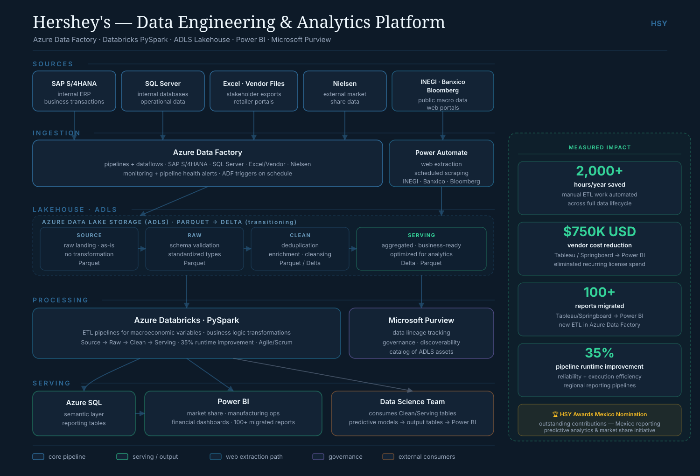
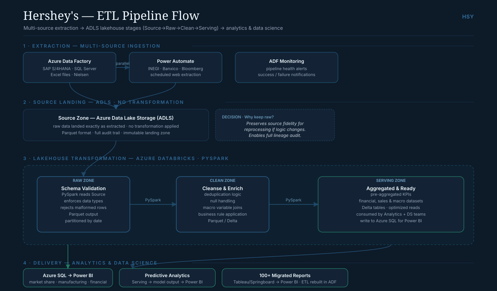

[:material-arrow-left: Case Studies](../index.md){ .back-link }

# Hershey's — Pipeline Automation & ETL Modernization

!!! abstract "Case Study Summary"
    **Client**: The Hershey Company — Mexico Reporting Center of Excellence  
    **Role**: Data Engineer & Reporting CoE Analyst  
    **Period**: Jun 2021 – Apr 2024  
    **Stack**: Azure Data Factory · Databricks · PySpark · Power BI · Azure Synapse · Blob Storage  

    **Impact**:

    - **$750K USD** in recurring vendor costs eliminated
    - **2,000+ hours** of manual work automated annually
    - **100+ legacy reports** migrated from third-party vendor to Power BI
    - **35%** improvement in pipeline reliability and runtime efficiency
    - Nominated at HSY Awards Mexico for contributions to the Mexico reporting initiative

## Context

Hershey's Mexico Reporting CoE ran a reporting setup that depended heavily on a third-party vendor — expensive, slow to change, and hard to maintain internally. A lot of the ETL was manual, consuming thousands of hours a year, and the pipelines had little monitoring.

My focus was to modernize the data stack, reduce vendor dependency, and build infrastructure the team could own and maintain.

## What I built

<figure class="diagram" markdown="span">
  
  <figcaption><strong>Platform architecture.</strong> Multi-source ingestion (SAP S/4HANA, SQL Server, vendor files, Nielsen, public macro data) via Azure Data Factory and Power Automate into an ADLS lakehouse (Source → Raw → Clean → Serving), transformed in Databricks/PySpark, served to Power BI. Click to enlarge.</figcaption>
</figure>

### ETL Pipeline Automation

Designed and built automated ETL pipelines across the data lifecycle using **Azure Data Factory** and **Databricks with PySpark**, replacing manual workflows that previously took 2,000+ hours of analyst time per year.

The pipelines covered:

- Financial datasets ingestion and normalization
- Sales and macroeconomic data integration
- Transformation and validation layers
- Delta Lake storage with partitioning for query performance

<figure class="diagram" markdown="span">
  
  <figcaption><strong>ETL flow.</strong> Multi-source extraction → raw landing in ADLS (kept as-is for reprocessing and lineage) → schema validation and cleansing in PySpark → a serving zone of pre-aggregated datasets consumed by analytics and data science, with Azure SQL feeding Power BI. Click to enlarge.</figcaption>
</figure>

### Vendor Migration — 100+ Reports

Led the migration of **100+ legacy reports** from the third-party vendor to Power BI — eliminating the recurring vendor contract entirely. Each migration included:

- Reverse-engineering the existing report logic
- Rebuilding the supporting ETL in Azure Data Factory
- Validating output parity against the original reports
- Handing off to the analytics team with documentation

This project alone eliminated **$750K USD** in annual vendor costs.

### Data Products for Analytics & Data Science

Delivered end-to-end data products integrating financial, sales, and macroeconomic datasets used by both analytics and data science teams. These products went from requirement gathering through deployment — including Power BI dashboards, semantic models, and the underlying pipeline infrastructure.

### Pipeline Optimization

Diagnosed and resolved reliability issues across regional reporting pipelines, achieving a **35% improvement** in pipeline runtime efficiency and significantly reducing failure rates.

## Tech Stack

- **Orchestration**: Azure Data Factory
- **Transformation**: Databricks (PySpark), Azure Synapse Analytics
- **Storage**: Azure Blob Storage / ADLS Gen2, Delta Lake
- **Visualization**: Power BI (DAX, semantic modeling)
- **Languages**: Python, PySpark, SQL, DAX
- **CI/CD**: Azure DevOps

## Key outcomes

| Metric | Result |
|---|---|
| Vendor cost reduction | $750,000 USD/year |
| Manual hours automated | 2,000+ hours/year |
| Legacy reports migrated | 100+ |
| Pipeline runtime improvement | 35% |
| Award recognition | HSY Awards Mexico nomination |

-   :material-calendar-check:{ .lg .middle } Similar challenges in your organization?

    ---

    Whether it's vendor dependency, manual ETL, or brittle reporting infrastructure — I've solved these problems at scale. Let's talk.

    [Book Intro Call :material-arrow-top-right:](https://calendly.com/andres-andresavila/introduction-call){ .md-button .md-button--primary }

