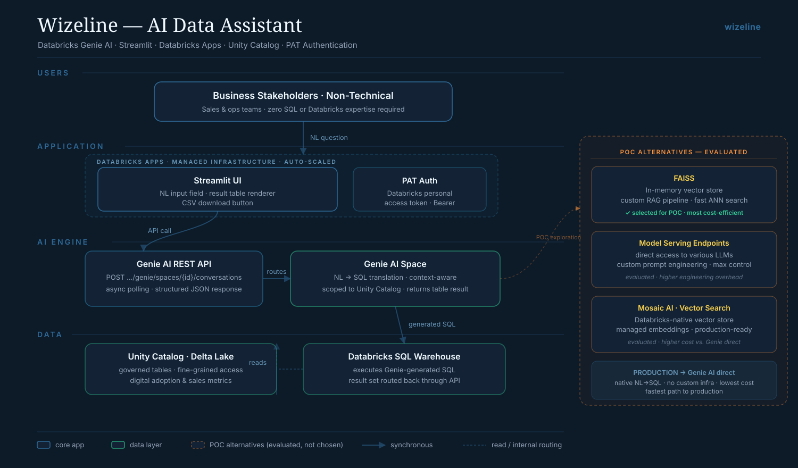
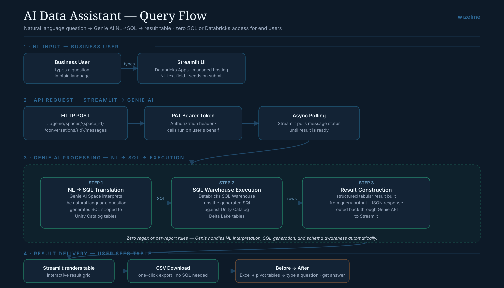

[:material-arrow-left: Case Studies](../index.md){ .back-link }

# Wizeline — AI Data Assistant & Pipeline Optimization

!!! abstract "Case Study Summary"
    **Company**: Wizeline (client: a large beverage & retail enterprise)  
    **Role**: Data Engineer II  
    **Period**: Apr 2024 – Sep 2024  
    **Stack**: Databricks (Genie AI · SQL Warehouse · Unity Catalog · Apps) · Streamlit · Python · PySpark  

    **Impact**:

    - **32% runtime reduction** on a production data pipeline
    - Shipped a natural-language data assistant that lets non-technical users query governed data without SQL
    - Ran the end-to-end POC comparing FAISS, Model Serving Endpoints and Mosaic AI Vector Search

## Context

Two parallel tracks during this engagement: a **production pipeline** that was running slower than it should, and a request from business teams who needed answers from governed data but didn't write SQL or use Databricks directly.

## Pipeline optimization

Profiled a production data pipeline, traced the performance bottlenecks to their root cause, and reworked the slow stages — bringing execution time down by **32%**. The point wasn't a rewrite; it was finding where the time was actually going and fixing those specific stages.

## AI data assistant

The second track was a natural-language assistant: a business user types a question in plain language and gets back a result table, with the SQL generation and schema awareness handled by **Databricks Genie AI**. The UI is a **Streamlit** app hosted on Databricks Apps, authenticated with a personal access token, reading governed tables in Unity Catalog.

<figure class="diagram" markdown="span">
  
  <figcaption><strong>Assistant architecture.</strong> A Streamlit UI on Databricks Apps sends a natural-language question to the Genie AI REST API, which translates it to SQL scoped to Unity Catalog and runs it on a Databricks SQL Warehouse; the result table routes back to the user, with a CSV export. Click to enlarge.</figcaption>
</figure>

### The POC: choosing the production path

Before settling on Genie AI direct, I ran an end-to-end proof of concept comparing three approaches for the natural-language layer:

- **FAISS** — an in-memory vector store with a custom RAG pipeline. Fast and the most cost-efficient of the three; selected as the POC baseline.
- **Model Serving Endpoints** — direct access to various LLMs with custom prompt engineering. Most control, but higher engineering overhead.
- **Mosaic AI Vector Search** — Databricks-native, managed embeddings, production-ready, but higher cost than going through Genie directly.

For production, **Genie AI direct** won: native NL→SQL, no custom retrieval infrastructure to maintain, and the lowest cost — the fastest path to something the business could actually use.

<figure class="diagram" markdown="span">
  
  <figcaption><strong>Query flow.</strong> Business user types a question in Streamlit → POST to the Genie AI API with a PAT bearer token → Genie translates NL to SQL, the SQL Warehouse runs it against Unity Catalog Delta tables → the result table renders back in Streamlit with one-click CSV export. Click to enlarge.</figcaption>
</figure>

## Tech Stack

- **Platform**: Databricks (Genie AI, SQL Warehouse, Unity Catalog, Databricks Apps)
- **App**: Streamlit, Python
- **Processing**: PySpark, SQL
- **Auth**: Databricks personal access token (Bearer)

## What this demonstrates

Two things I do well: **finding where a pipeline actually spends its time** and fixing that rather than rewriting, and **picking the pragmatic AI path** — I evaluated custom RAG options but shipped the managed one that cost less and needed no infrastructure to maintain. Newer isn't always better; the right call is the one the team can run.

-   :material-calendar-check:{ .lg .middle } Want self-serve data for non-technical teams?

    ---

    I build natural-language access to governed data — and I'll tell you when the simple managed option beats a custom one. Let's talk.

    [Book Intro Call :material-arrow-top-right:](https://calendly.com/andres-andresavila/introduction-call){ .md-button .md-button--primary }

